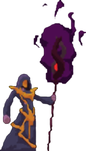

<!-- Improved compatibility of back to top link: See: https://github.com/othneildrew/Best-README-Template/pull/73 -->
<a name="readme-top"></a>
<!--
*** Thanks for checking out the Best-README-Template. If you have a suggestion
*** that would make this better, please fork the repo and create a pull request
*** or simply open an issue with the tag "enhancement".
*** Don't forget to give the project a star!
*** Thanks again! Now go create something AMAZING! :D
-->


<!-- PROJECT SHIELDS -->
<!--
*** I'm using markdown "reference style" links for readability.
*** Reference links are enclosed in brackets [ ] instead of parentheses ( ).
*** See the bottom of this document for the declaration of the reference variables
*** for contributors-url, forks-url, etc. This is an optional, concise syntax you may use.
*** https://www.markdownguide.org/basic-syntax/#reference-style-links
-->
[![Portfolio][moreinfo-shield]][moreinfo-url]
[![LGPL License][license-shield]][license-url]
[![LinkedIn][linkedin-shield]][linkedin-url]


<!-- PROJECT LOGO -->
<br />
<div align="center">
  <a href="https://github.com/empobla/BewareOfTheRavens">
    
  </a>

<h3 align="center">Beware of the Ravens!</h3>

  <p align="center">
    A simple 2D side-scrolling game in which players defend themselves from an endless onslaught of ravens and fireballs.
    <br />
    <br />
    ·
    <a href="https://bewareoftheravens.demo.emilioppv.com/">View Demo</a>
    ·
  </p>
</div>


<!-- TABLE OF CONTENTS -->
<details>
  <summary>Table of Contents</summary>
  <ol>
    <li>
      <a href="#about-the-project">About The Project</a>
      <ul>
        <li><a href="#built-with">Built With</a></li>
      </ul>
    </li>
    <li>
      <a href="#getting-started">Getting Started</a>
      <ul>
        <li><a href="#prerequisites">Prerequisites</a></li>
        <li><a href="#installation">Installation</a></li>
      </ul>
    </li>
    <li><a href="#license">License</a></li>
    <li><a href="#contact">Contact</a></li>
    <li><a href="#acknowledgements">Acknowledgements</a></li>
  </ol>
</details>


<!-- ABOUT THE PROJECT -->
## About The Project

[![Beware of the Ravens Screen Shot][product-screenshot]](https://bewareoftheravens.demo.emilioppv.com)

Beware of the Ravens! is a simple 2D side-scrolling game in which players defend themselves from an endless onslaught of ravens and fireballs. This was a game created for my Algorithms for Games class, with challenging features I had to implement without using the engine's help.

<p align="right">(<a href="#readme-top">back to top</a>)</p>


### Built With

[![Unity][Unity]][Unity-url]
[![C#][C#]][C#-url]

<p align="right">(<a href="#readme-top">back to top</a>)</p>


<!-- GETTING STARTED -->
## Getting Started

To get a local copy up and running follow these simple example steps.

### Prerequisites

This project requires Unity Engine version 2021.2.0f1.

### Installation

1. Clone the repo
   ```sh
   git clone https://github.com/empobla/BewareOfTheRavens.git
   ```
2. Open the project folder with Unity Hub.
3. In the project navigator, go to the assets directory and find the "Scenes" folder.
4. Click on the "BewareTheRavens" scene to load it.
5. Go to Unity->File->Build Settings and verify that all the scenes in the "Scenes" folder are in the "Scenes in Build" list.
6. If scenes from the "Scenes" folder are missing or are not in the build list, add the scenes to the build list and enable them.
7. The game should be ready for building and running.

<p align="right">(<a href="#readme-top">back to top</a>)</p>


<!-- LICENSE -->
## License

Distributed under the GNU Lesser General Public License (LPGL) License. See LICENSE.txt for more information.

Sample code by Leonard D. Brown, University of Arizona. This program was developed for educational purposes only. Media assets contained within this program may not be redistributed without written permission of authors.

<p align="right">(<a href="#readme-top">back to top</a>)</p>


<!-- CONTACT -->
## Contact

Emilio Popovits Blake - [Contact](https://emilioppv.com/contact)

Project Link: [https://github.com/empobla/BewareOfTheRavens](https://github.com/empobla/BewareOfTheRavens)

<p align="right">(<a href="#readme-top">back to top</a>)</p>


<!-- ACKNOWLEDGEMENTS -->
## Acknowledgements

Freeware media assets were used from the following sources:
1. https://graphicriver.net/
2. https://sventhole.itch.io/
3. https://opengameart.org/
2. https://www.gameartguppy.com/
3. https://www.videvo.net/
4. https://freesound.org/

<p align="right">(<a href="#readme-top">back to top</a>)</p>


<!-- MARKDOWN LINKS & IMAGES -->
<!-- https://www.markdownguide.org/basic-syntax/#reference-style-links -->
[license-shield]: https://img.shields.io/github/license/empobla/BewareOfTheRavens.svg?style=for-the-badge
[license-url]: https://github.com/empobla/BewareOfTheRavens/blob/master/LICENSE.txt
[linkedin-shield]: https://img.shields.io/badge/-LinkedIn-black.svg?style=for-the-badge&logo=linkedin&colorB=555
[linkedin-url]: https://linkedin.com/in/emilio-popovits

[product-screenshot]: README/images/thumbnail.png

[Unity]: https://img.shields.io/badge/unity-000000?style=for-the-badge&logo=unity&logoColor=white
[Unity-url]: https://unity.com/
[C#]: https://img.shields.io/badge/c%23-239120?style=for-the-badge&logo=csharp&logoColor=ffffff
[C#-url]: https://learn.microsoft.com/en-us/dotnet/csharp/

[moreinfo-url]: https://emilioppv.com/portfolio/beware-of-the-ravens!
[moreinfo-shield]: https://img.shields.io/badge/more%20info-1b1f24?style=for-the-badge&logo=data:image/png;base64,iVBORw0KGgoAAAANSUhEUgAAAA4AAAAOCAMAAAAolt3jAAAABGdBTUEAALGPC/xhBQAAACBjSFJNAAB6JgAAgIQAAPoAAACA6AAAdTAAAOpgAAA6mAAAF3CculE8AAAApVBMVEUbHyQbHyQbHyRnam2sra+vsbKys7Wsrq+goqQwNDgaHyQaIilbXWGChIZMT1OYmpwYQFoaICYXRF8WUHQZLjwvMzdwcnaztLZ1d3pcX2IaICUXTG0WUHMXS2sXSGcWT3MaKjcpLTFVWFyFh4lTVllvcnWpqqwYOEwZM0QXTW4XTnAaJS8lKS3IycoYPlYaIyt4e36rra60tba5urutr7BQU1cAAAB8HBV3AAAAAnRSTlOR/KrCyFQAAAABYktHRDZHv4jRAAAACXBIWXMAAAsTAAALEwEAmpwYAAAAB3RJTUUH5wEZCiUZVutNzgAAAGpJREFUCNdjYGBkggNGBmQeiM+EAjC5zCwsrGzsHJwQLhc3ExMPLxMfP5OAIBODkLCIqBi/uASHpJS0jCyDnLyCopIyh4qqmrqGphYDk5Q2WLGOrh63PsgoA0NDI2NDE1PsFqFw0RyJ6gUAuK4HVipJCoQAAAAuelRYdGRhdGU6Y3JlYXRlAAAImTMyMDLWNTDUNTINMTSwMja3MjLVNjCwMjAAAEFRBQlQZi6pAAAALnpUWHRkYXRlOm1vZGlmeQAACJkzMjAy1jUw1DUyDTE0sDI2tzIy1TYwsDIwAABBUQUJeVmGIQAAAABJRU5ErkJggg==